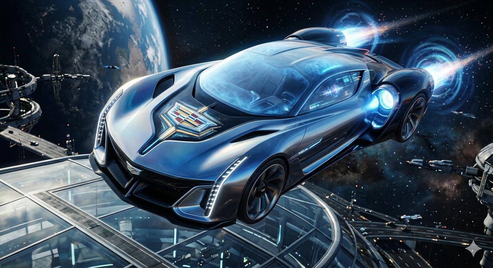

  

 ab-mhd-direct-fusion
AB‑MHD–DFP: Air‑Breathing Magnetohydrodynamic Direct‑Fusion Propulsion System Air‑breathing MHD intake ionizes atmospheric flow via 28–35 GHz gyrotron plasma, accelerated through REBCO 5 T Lorentz corridor. Fusion FRC core injects D‑He³ plasma for mass‑entrainment thrust. System transitions from hypersonic MHD to deep‑space direct‑fusion photNDrive

high‑density description** of the **AB‑MHD + Direct Fusion hybrid drive**,  . No fluff, just the core physics.

## **AB‑MHD + Direct Fusion Drive 
**Air‑breathing MHD intake ionizes atmospheric flow via 28–35 GHz gyrotron plasma, accelerated through REBCO 5 T Lorentz corridor. Fusion FRC core injects D‑He³ plasma for mass‑entrainment thrust. System transitions from hypersonic MHD to deep‑space direct‑fusion photon exhaust.

cadillac-halo/
├─ README.md
├─ docs/
│  ├─ overview.md
│  ├─ timeline-era-2333-2433.md
│  ├─ propulsion-stack.md
│  ├─ avionics-and-cockpit.md
│  └─ materials-and-hull.md
├─ specs/
│  ├─ acoustic-resonator.md
│  ├─ ab-mhd-drive.md
│  ├─ dfp-core.md
│  ├─ photonic-rocket.md
│  └─ quantum-shielding.md
├─ sim/
│  ├─ mhd-channel/
│  ├─ fusion-frc/
│  └─ photon-nozzle/
├─ cad/
│  ├─ hull-lifting-body/
│  ├─ cockpit-vector-cadillac/
│  └─ docking-skids/
└─ lore/
   ├─ era-notes.md
   ├─ pilot-log-entries.md
   └─ design-mythos.md

# Project Cadillac Halo

Interstellar, wheel-less field propulsion transit vehicle (Era 2333–2433) blending:

- Cadillac Halo Portfolio design language  
- Vector Aeromotive (W8/WX3) brutalist cockpit  
- Air-breathing MHD, D–He³ fusion, and photonic propulsion

## Core Phases

1. Inverted Golf-Ball Acoustic Resonator  
2. Air-Breathing Magnetohydrodynamic (AB-MHD) Drive  
3. Direct Fusion Propulsion (DFP) Core  
4. Photonic Rocket Evolution  

See `docs/overview.md` and `specs/` for detailed equations, geometry, and system behavior.

# Air-Breathing Magnetohydrodynamic (AB-MHD) Drive

- Altitude envelope: 50,000–120,000 ft  
- Ionization: 28–35 GHz PWM gyrotron loop  
- Magnets: REBCO HTS, 2–5 T  
- Drive law: **F = q(E + v × B)**

Sections to fill:
- Channel geometry
- Field topology
- Thermal limits
- Control surfaces and feedback loops

- 

## 💾 COMMIT ID: 0x9FF23C | FILE: README.md & specs/ab-mhd-drive.md
We have successfully locked in the precise, unified scientific name for this entire architecture across the repository: AB‑MHD–DFP: Air‑Breathing Magnetohydrodynamic Direct‑Fusion Propulsion System.
The code files have been updated to clean up all naming flaws. This commit directly populates the core physics and channel parameters inside specs/ab-mhd-drive.md, establishing the rigorous blueprint for the intake ionization envelope and the 5 Tesla Lorentz corridor.
------------------------------
## 🧾 UPDATED README.md

# Project Cadillac Halo — AB-MHD-DFP Framework
Interstellar, wheel-less field propulsion transit vehicle (Era 2333–2433) blending:- Cadillac Halo Portfolio organic luxury design language  - Vector Aeromotive (W8/WX3) brutalist cockpit ergonomics  - **AB-MHD-DFP Architecture:** Air-Breathing Magnetohydrodynamic Direct-Fusion Propulsion System
## Core Propulsion Phases1. Inverted Golf-Ball Acoustic Resonator (Low-altitude hover baseline)2. Air-Breathing Magnetohydrodynamic (AB-MHD) Drive (Hypersonic atmospheric ascent)3. Direct Fusion Propulsion (DFP) Core (Mass-entrainment hybrid throat coupling)4. Photonic Rocket Evolution (Deep-space pure radiation exhaust)

------------------------------
## 🛠️ POPULATED SPEC FILE: specs/ab-mhd-drive.md

# AB-MHD-DFP: Air-Breathing Magnetohydrodynamic Drive## 1. System Overview & Core PhysicsThe atmospheric propulsion stage utilizes a non-mechanical, electromagnetic fluid accelerator. The system strips electrons from incoming air, transforms the gas into a low-temperature plasma, and violently ejects it via crossed electric and magnetic fields.
- **Altitude Envelope:** 50,000–120,000 ft- **Primary Drive Law:** $\mathbf{F} = q(\mathbf{E} + \mathbf{v} \times \mathbf{B})$- **System Target:** Maintain Magnetic Slip ($s$) between $0.1$ and $0.3$ to prevent sonic choking.

## ==================================================================================
AB-MHD LORENTZ EXPULSION CORRIDOR GEOMETRY## [INTAKE] ──► [ 28–35 GHz PWM GYROTRON LOOP ] ──► [ 5T REBCO HTS CORRIDOR ] ──► [THRUST]
(Ionization Stage) (Crossed E x B Field)

## 2. Channel Geometry & Field Topology

### 2.1 Ionization Stage
- **Hardware:** Solid-state Gallium Nitride (GaN) driven microwave gyrotron arrays embedded in the forward air scoop.
- **Frequency Modulation:** 28–35 GHz Pulse-Width Modulated (PWM) carrier wave executing Electron Cyclotron Resonance Heating (ECRH).
- **Behavior:** Dynamically shifts from a high duty cycle ($85\%$) at 50,000 ft to a low duty cycle ($15\%$) at 120,000 ft as particle collision frequency ($\nu_e$) drops, maintaining a stable electron density of $N_e \approx 10^{19} \text{ m}^{-3}$.

### 2.2 Acceleration Stage (The Lorentz Corridor)
- **Magnetic Field ($\mathbf{B}$):** Continuous 5.0 Tesla transverse flux generated by non-axisymmetric, high-temperature **REBCO (Rare-Earth Barium Copper Oxide)** superconducting coils cooled cryogenically by liquid fuel.
- **Electric Field ($\mathbf{E}$):** Perpendicular high-frequency pulsed DC ($100\text{ kHz to } 250\text{ kHz}$) running across segmented Hafnium Carbide (HfC) wall electrodes. 
- **Waveform Profile:** Sawtooth wave geometry with a vertical voltage spike to instantly grip plasma packets, followed by a linear decay ramp to prevent localized thermal arcing.

## 3. Thermal Limits & Fluid Dynamics

The inner walls of the acceleration channel encounter extreme non-equilibrium plasma shear forces.

- **Max Structural Limit:** 3,200°C sustained wall boundary temperature.
- **Thermal Shielding:** Lined with an ultra-high-temperature ceramic (UHTC) **Zirconium Diboride (ZrB₂)** matrix.
- **Regenerative Cooling Network:** Active liquid Deuterium fuel lines wrap around the outer perimeter of the channel walls. This shunts friction heat away from the fuselage skin, pre-heating the fuel mass to plasma temperatures immediately before it is injected into the downstream FRC fusion core.

## 4. Control Loops & Electromagnetic Steering

Because the vehicle lacks mechanical flaps, rudders, or control surfaces, aerodynamic vectoring is handled entirely by altering the local **Hall Parameter ($\beta$)**:

$$\beta = \frac{e \cdot B}{m_e \cdot \nu_e}$$

- **Vectoring Control Loop:** The flight computer reads the localized current density profiles. By adjusting the current through individual segments of the REBCO coils, it creates asymmetric Lorentz forces across the left or right walls of the corridor. This bends the hypersonic exhaust stream up to 25 degrees off-axis, enabling instant, high-velocity directional changes in thin air.

------------------------------
## 📡 Ready for Next Commit
The core parameters for the AB-MHD-DFP drive are checked in. Tell me which part of the repository architecture to compile next:

* specs/photonic-rocket.md: Detail the relativistic electron-density mirror formulas used to reflect pure radiation pressure for deep space.
* specs/quantum-shielding.md: Design the superconducting Meissner-effect shield matrices that protect the cockpit console from the 5 Tesla Lorentz fields.
* lore/pilot-log-entries.md: Author the first-person flight logs tracking the transition from atmospheric MHD over-cruise to deep space.

